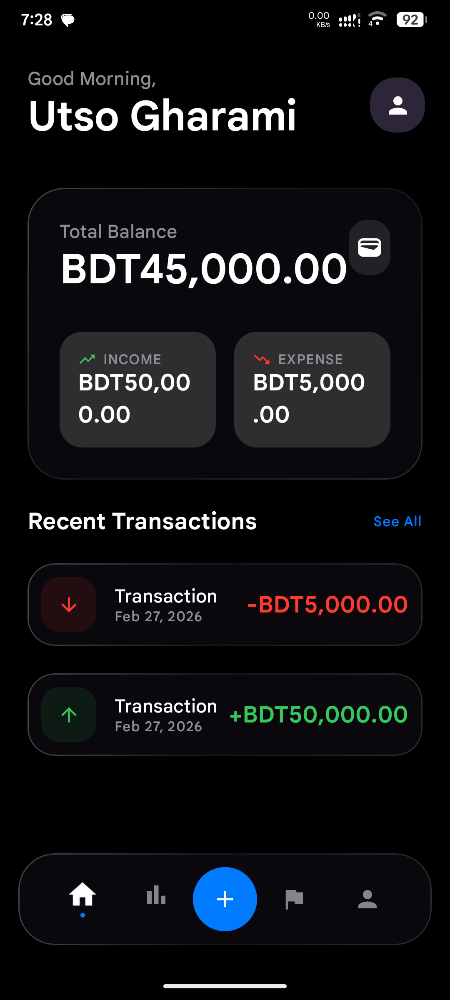
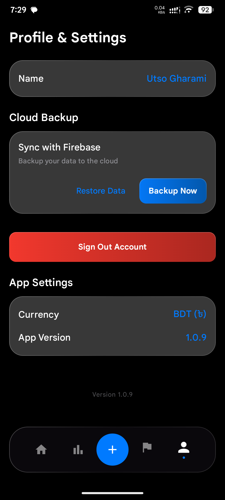
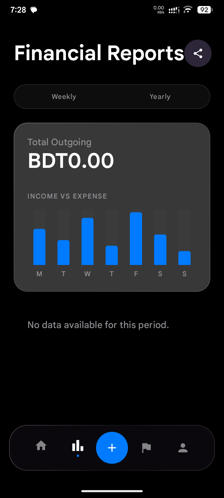
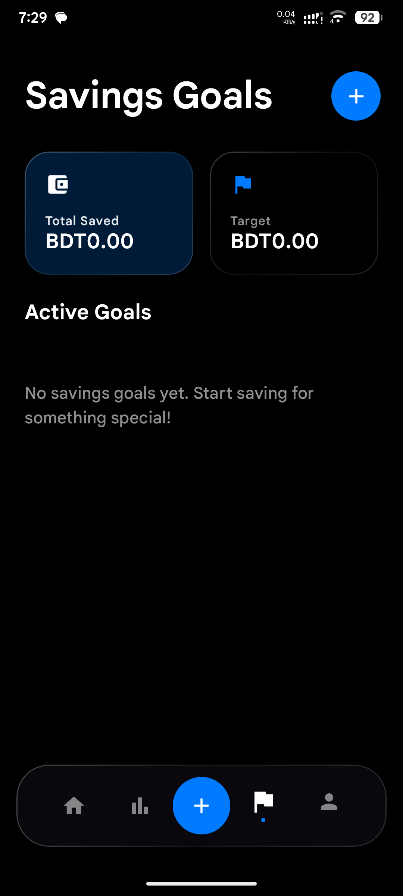

  #
  (SmartBudge)

  **A sleek and intuitive Android application for managing your personal finances, tracking expenses, and staying on top of your budget.**

  [](https://kotlinlang.org/)
  [](https://developer.android.com/)
  [](https://developer.android.com/jetpack/compose)

</div>

<br/>

## 🌟 Overview

Stitch (also known as SmartBudge) is a modern Android application designed to help users take control of their financial lives. Built entirely with native Android technologies like **Kotlin** and **Jetpack Compose**, it offers a buttery-smooth, premium user interface with interactive animations and a dark-mode optimized design.

Whether you're tracking daily expenses, monitoring your overall balance, or analyzing your spending habits, Stitch provides the tools you need in a beautifully crafted package.

---

## ✨ Key Features

- **💰 Expense & Income Logging**: Easily log new transactions with a dedicated, intuitive UI.
- **📊 Real-time Dashboard**: View your current balance, total income, and total expenses at a glance.
- **📜 Transaction History**: A detailed list of all your past activities, complete with editing and deletion capabilities.
- **📈 Insightful Reports**: (Coming Soon) Visual breakdowns of your financial habits to help you save more.
- **🎨 Premium UI/UX**: Designed with modern, glowing aesthetics, smooth transitions, and a focus on user experience.

---

## 📸 Screenshots

<div align="center">
  <h3>🏠 Home & Navigation</h3>
  
  
  
  <br/><br/>
  <h3>📊 Insights & Goals</h3>
  
  
</div>

---

## 🛠️ Technology Stack

This application leverages modern Android development best practices and libraries:

*   **Language**: Kotlin
*   **UI Toolkit**: Jetpack Compose (Declarative UI)
*   **Architecture**: MVVM (Model-View-ViewModel)
*   **Local Database**: Room persistence library
*   **Dependency Injection**: Hilt / Dagger (if applicable)
*   **Asynchrony**: Kotlin Coroutines & Flow

---

## 🚀 Getting Started

### Prerequisites

To build and run this project, you'll need:

1.  **Android Studio** (Koala or newer recommended).
2.  Java Development Kit (**JDK**) 17 or higher.
3.  An Android device or emulator running **API level 24 (Android 7.0)** or higher.

### Installation

1.  **Clone the repository:**
    ```bash
    git clone https://github.com/utsogharami5-source/stitch-app.git
    ```
2.  **Open the project:**
    Open Android Studio -> `File | Open...` -> select the `stitch-app` directory.
3.  **Build and Run:**
    Wait for Gradle to sync dependencies. Then, select your target device and click the **Run** ▶️ button.

---

## 🎯 Architecture

The app follows a modern Android architecture utilizing **MVVM** and **Clean Architecture** principles.

- **UI Layer (`app/ui`)**: Contains all Jetpack Compose screens, components, and ViewModels.
- **Data Layer (`app/data`)**: Manages the Room database, DAOs, and repository implementations.
- **Domain Layer (`app/domain`)**: Contains the core business logic, including models and use cases.

---

## 🤝 Contributing

Contributions, issues, and feature requests are welcome!

1.  Fork the Project
2.  Create your Feature Branch (`git checkout -b feature/AmazingFeature`)
3.  Commit your Changes (`git commit -m 'Add some AmazingFeature'`)
4.  Push to the Branch (`git push origin feature/AmazingFeature`)
5.  Open a Pull Request

---

<div align="center">
  <i>Built with ❤️ for a better financial future.</i>
</div>
